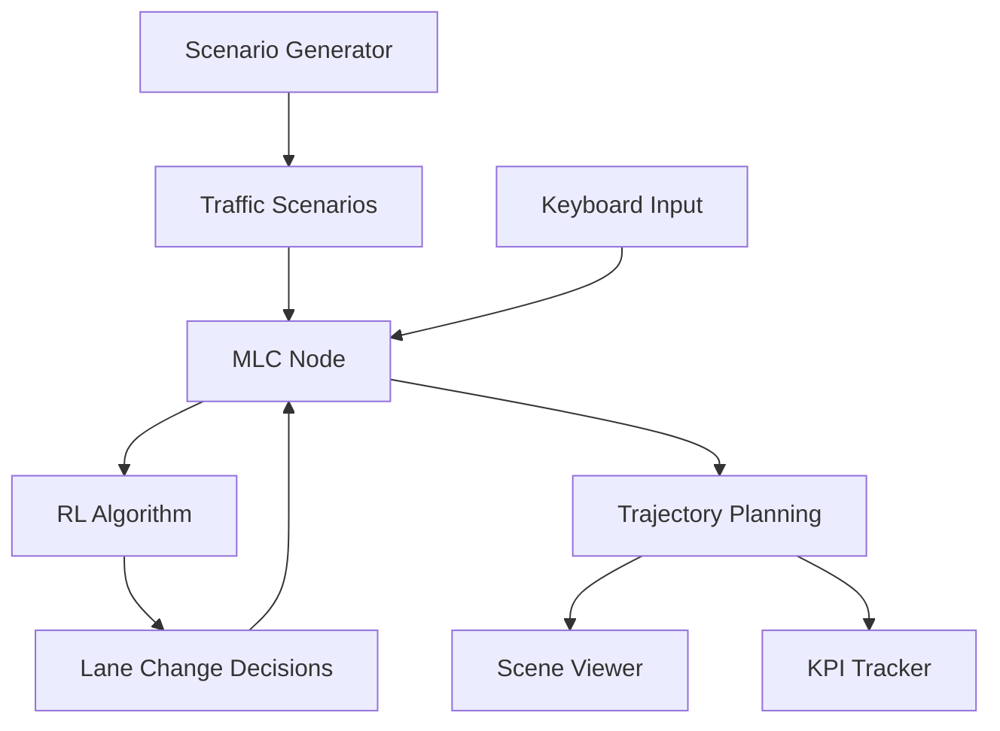

# IMLCA: Intelligent Multi-Lane Change Agent

<div align="center">

[](LICENSE)
[](http://wiki.ros.org/noetic)
[](https://www.python.org)
[](https://www.docker.com)

*An intelligent highway driving assistant that performs automated multi-lane changes using deep reinforcement learning*

</div>

---

## 🎯 Overview

IMLCA (Intelligent Multi-Lane Change Agent) is a sophisticated autonomous driving research platform that combines deep reinforcement learning with ROS-based simulation. The system intelligently performs multi-lane changes on highways by learning optimal driving policies through a Deep Q-Network (DQN) trained on realistic traffic scenarios.

### Key Features

- 🧠 **Deep Reinforcement Learning**: DQN-based decision making with Stable Baselines3
- 🛣️ **Multi-Lane Highway Simulation**: Dynamic traffic scenarios with multiple vehicles  
- 🎮 **Real-time Visualization**: 2D scene viewer and 3D Panda3D simulation
- 🔧 **ROS Integration**: Modular architecture with multiple specialized nodes
- 🐳 **Cross-Platform**: Docker support for macOS/Windows with GUI
- 📊 **Performance Monitoring**: Real-time KPI tracking and analysis
- ⌨️ **Manual Override**: Keyboard controls for testing

---

## 🎬 Demo Videos

### 2D ROS Simulation
Watch the real-time 2D visualization of the multi-lane change algorithm in action:

<!-- Replace this URL with the GitHub-generated URL after uploading to an issue -->
[UPLOAD_2D_VIDEO_TO_GITHUB_ISSUE_AND_REPLACE_THIS_TEXT_WITH_THE_URL]

### 3D Highway Pilot Demo
Experience the immersive 3D Panda3D visualization of intelligent highway driving:

<!-- Replace this URL with the GitHub-generated URL after uploading to an issue -->
[UPLOAD_3D_VIDEO_TO_GITHUB_ISSUE_AND_REPLACE_THIS_TEXT_WITH_THE_URL]

> **📝 How to add videos:** 
> 1. Go to Issues → New Issue
> 2. Drag your video files into the description
> 3. Copy the generated URLs and replace the placeholders above
> 4. The videos will then display inline in your README!

---

## 🚀 Quick Start

### macOS/Windows (Recommended)

The easiest way to get started is using Docker with GUI support:

```bash
# Clone the repository
git clone https://github.com/baderabdallah/IMLCA.git
cd IMLCA

# Run with default visualization (2D + 3D)
./scripts/run_macos_gui.sh
```

### Ubuntu/Linux (Native)

For native ROS development:

```bash
# Build the workspace
catkin_make
source devel/setup.sh

# Launch the system
roslaunch manual_controller_visuals.launch
```

---

## 🏗️ Architecture

### System Components



### Core Technologies

- **🤖 Reinforcement Learning**: Deep Q-Network (DQN) with experience replay
- **🛠️ Robotics Framework**: ROS Noetic for real-time communication
- **🎮 Simulation Environment**: Highway-env gymnasium environment
- **👁️ Visualization**: Panda3D 3D engine + matplotlib 2D plotting
- **🔄 State Management**: Finite state machine for lane change logic

---

## 📋 Requirements & Installation

### Docker Setup (macOS/Windows)

**Prerequisites:**
- [Docker Desktop](https://www.docker.com/products/docker-desktop)
- [XQuartz](https://www.xquartz.org) (macOS only)

**macOS Setup:**
```bash
# Install XQuartz and configure X11 forwarding
# In XQuartz Preferences > Security: check "Allow connections from network clients"
# Restart XQuartz, then run:
xhost + 127.0.0.1

# For Apple Silicon users:
export DOCKER_DEFAULT_PLATFORM=linux/amd64
```

### Native Ubuntu Setup

**System Requirements:**
- Ubuntu 20.04 LTS
- ROS Noetic
- Python 3.8+

**Install Dependencies:**
```bash
# Install ROS Noetic (if not already installed)
sudo apt update
sudo apt install ros-noetic-desktop-full

# Install Python packages
pip install panda3d==1.10.14
pip install -U panda3d-gltf
pip install stable-baselines3[extra]
pip install highway-env
```

---

### Docker Usage

```bash
# Default launch (2D + 3D visualization)
./scripts/run_macos_gui.sh

# Panda3D only
LAUNCH_FILE=manual_controller_panda3d_visuals.launch ./scripts/run_macos_gui.sh

# Headless mode
LAUNCH_FILE=manual_controller_headless.launch ./scripts/run_macos_gui.sh
```

### Manual Controls

| Key | Action |
|-----|--------|
| `↑` | Change to left lane |
| `↓` | Change to right lane |
| `←` | Decrease speed |
| `→` | Increase speed |

---

## 🧠 Machine Learning Details

### Reinforcement Learning Setup

- **Algorithm**: Deep Q-Network (DQN)
- **Framework**: Stable Baselines3
- **Environment**: highway-env (gymnasium)
- **Network Architecture**: MLP (256×256 hidden layers)
- **Training Steps**: 20,000+ timesteps
- **Experience Buffer**: 15,000 transitions

### Model Configuration

```python
model = DQN(
    "MlpPolicy",
    env,
    policy_kwargs=dict(net_arch=[256, 256]),
    learning_rate=5e-4,
    buffer_size=15000,
    learning_starts=200,
    batch_size=32,
    gamma=0.8,
    train_freq=1,
    target_update_interval=50,
)
```

---

## 🔧 ROS Node Architecture

### Core Nodes

| Node | Purpose | Publications | Subscriptions |
|------|---------|-------------|---------------|
| **scenario_generator_node** | Traffic scenario generation | `/mlc/scenario_information` | - |
| **mlc_node** | Multi-lane change logic | `/mlc/mlc_data` | `/mlc/scenario_information` |
| **rl_algo_node** | RL decision making | - | `/mlc/scenario_information` |
| **scene_viewer_node** | 2D visualization | - | `/mlc/mlc_data`, `/kpi` |
| **kpi_node** | Performance tracking | `/kpi` | `/mlc/mlc_data` |
| **state_converter_node** | Data format conversion | - | Various |

### Message Types

```bash
# Core message definitions
src/lane_msgs/msg/
├── ScenarioData.msg    # Traffic scenario information
├── Mlc.msg            # Multi-lane change data
├── VehicleInfo.msg    # Individual vehicle state
├── Trajectory.msg     # Planned trajectory
├── EgoInfo.msg        # Ego vehicle information
└── KPIs.msg           # Performance metrics
```

---

## 📊 Performance Monitoring

The system tracks various Key Performance Indicators (KPIs):

- **Lane Changes**: Number of successful lane changes
- **Average Velocity**: Overall speed performance
- **Safety Metrics**: Collision avoidance rates

---

## 🤝 Contributing

We welcome contributions! Please see our contributing guidelines:

1. Fork the repository
2. Create a feature branch (`git checkout -b feature/amazing-feature`)
3. Commit your changes (`git commit -m 'Add amazing feature'`)
4. Push to the branch (`git push origin feature/amazing-feature`)
5. Open a Pull Request

---

## 📄 License

This project is licensed under the MIT License - see the [LICENSE](LICENSE) file for details.

---

<div align="center">

**[⭐ Star this repository](https://github.com/baderabdallah/IMLCA) if you find it helpful!**

</div>

