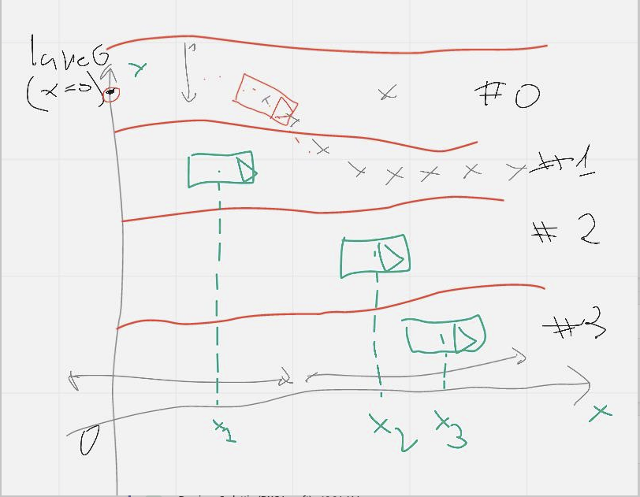
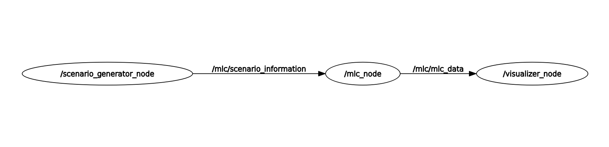

# Multi Lane Change Assist
## 2D Simulator (old)

## 2D Simulator with Panda3d and a Speedometer

## 3D Simulation

## 2D simulation with manual lane change


## Requirements
- Ubuntu 20.04
- ROS Noetic
- The 'Panda3D' framework (https://www.panda3d.org)
- The 'panda3d-gltf' plugin

## Description

The system guides the ego vehicle to perform a multi-lane change in order to reach a predefined target lane at least two lanes away from the initial position of the ego vehicle.

The multi-lane change includes two main parts,
- The decision to make a lane change
- The algorithm to make the lane change.

The decision to make a lane change depends mainly on a collision check between the computed trajectory and the expected trajectory of near vehicle. while the lane change is a 3rd degree polynomial function that calculates the lateral change of distance required to perform the lane change over time.

A single lane change is done over a predefined distance, based on which the trajectory is computed. eventually the changing lane trajectory is d(t)=At^2+Bt+C, where d is the distance at each time step, t is time, and the coefficients are calculated based on how fast the lane change is to be performed.




## Installing required packages
Install the 'Panda3D' framework, version 1.10.14 or above
```console
$ pip install panda3d==1.10.14
```

Install the 'panda3d-gltf' plugin
```console
$ pip install -U panda3d-gltf
```

## Building and Running
From the workspace folder run
```console
$ catkin_make
```
source the workspace
```console
$ source devel/setup.sh
```
launch the MLC assist
```console
$ roslaunch multi_lane_assist.launch
```

## ROS node structure
- scenario_generator_node
    - Publications:
        - /mlc/scenario_information [lane_msgs/ScenarioData]

 - mlc_node
    - Publications:
       - /mlc/mlc_data [lane_msgs/Mlc]

    - Subscriptions:
        - /mlc/scenario_information [lane_msgs/ScenarioData]


  - visualizer_node
    - Subscriptions:
        - /mlc/mlc_data [lane_msgs/Mlc]



